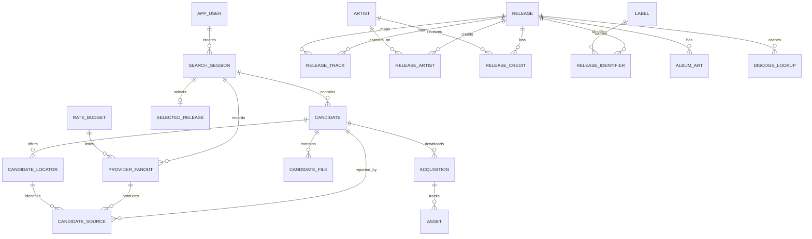
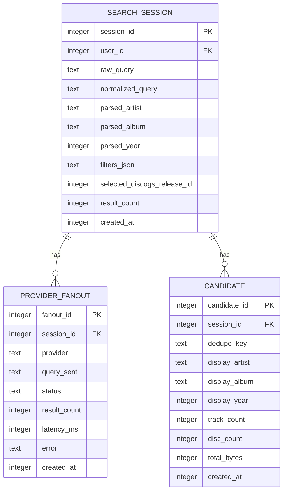
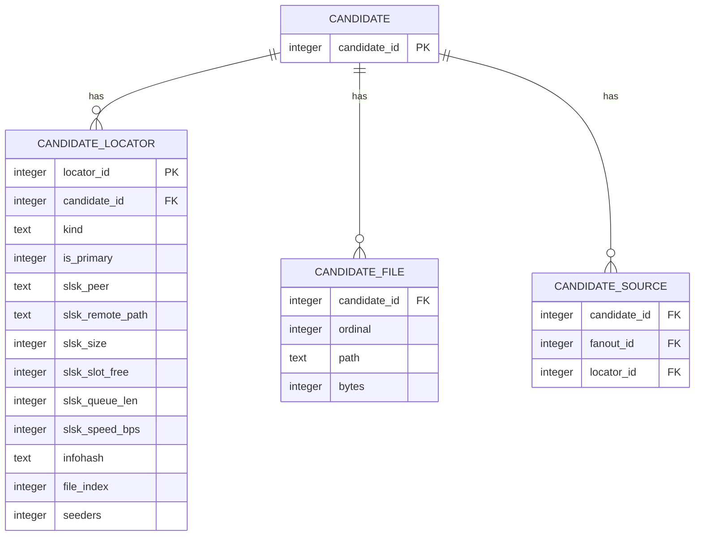
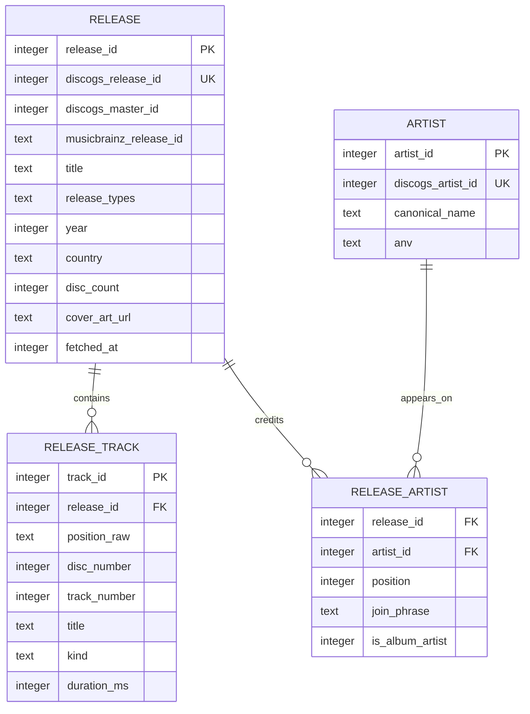
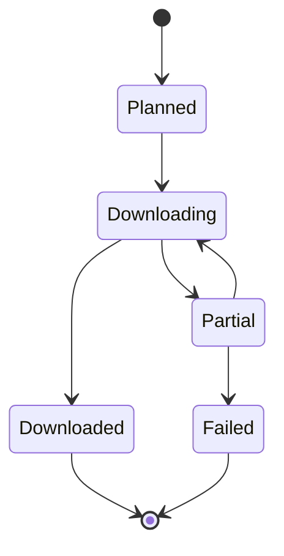

# Aldo Data Model

Aldo uses SQLite. The database stores search history, provider results,
catalog metadata, downloads, and rate budgets.

## Entity relationship diagram

`SELECTED_RELEASE` is shown conceptually. The current schema stores the public
Discogs release ID on `search_session` as `selected_discogs_release_id`.

## Core tables

### Search tables

The unique `(session_id, dedupe_key)` index collapses duplicate reports inside
one search. A candidate can have several locators from different peers.

### Provider source tables

`is_primary` selects the source used for a download. Available sources are
preferred over queued sources.

### Catalog tables

`position_raw` is retained because Discogs positions can be `A`, `2C`, or
`1-3`. The parsed numeric fields support ordering, but the raw value preserves
the original pressing information.

## Acquisition state

An acquisition has one asset row per expected file. Asset progress is separate
from acquisition progress so interrupted downloads can be resumed or diagnosed.

## Migration rules

1. Add schema changes as a new numbered SQL migration.
2. Keep migrations forward-only.
3. Enable foreign keys on every SQLite connection.
4. Use checked narrowing helpers when reading SQLite integers into domain types.
5. Preserve raw provider values when normalization could lose information.
