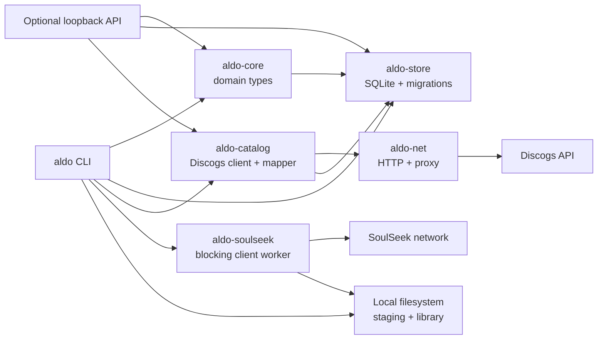
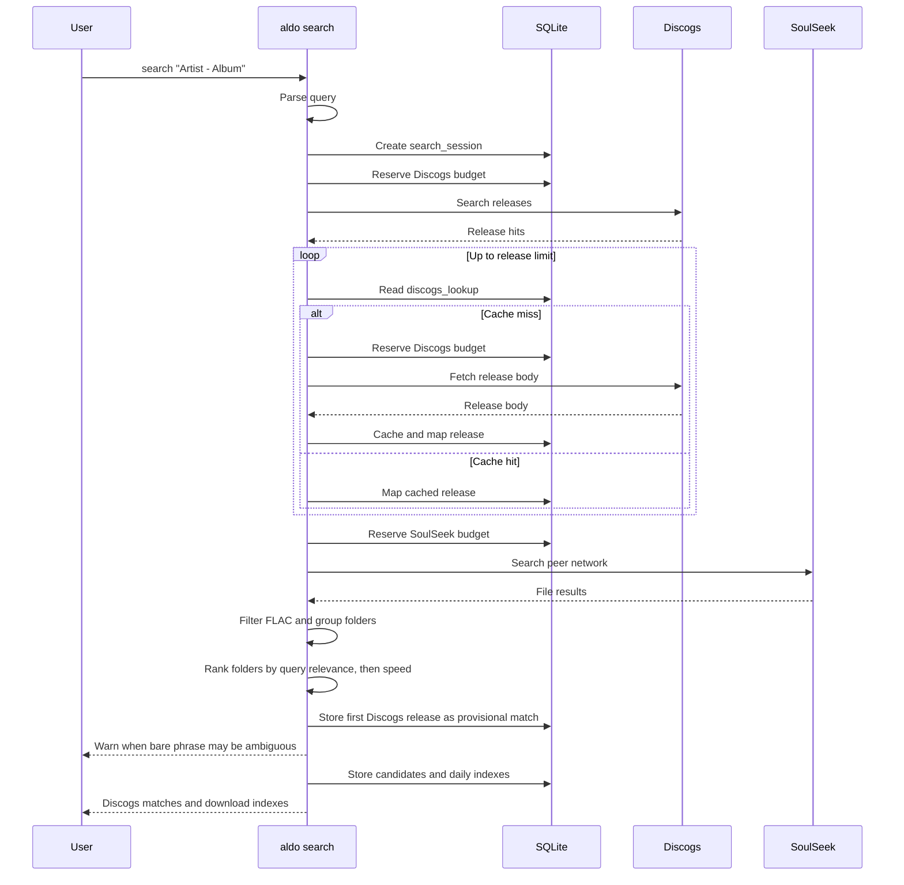
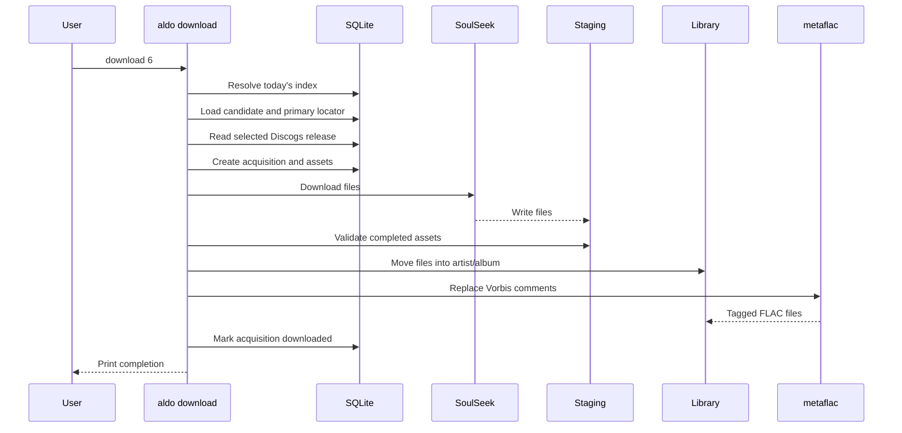

# Aldo System Design

Aldo is a local-first CLI for finding FLAC releases, downloading files from
SoulSeek, and applying Discogs metadata.

The current product is a single-user application. The optional HTTP API exists
for a future GUI, but the CLI is the primary interface.

## High-level architecture



### Responsibilities

| Component | Responsibility |
|---|---|
| `aldo-core` | Strong domain types, provider interfaces, query parsing |
| `aldo-store` | SQLite schema, migrations, persistence, rate budgets |
| `aldo-net` | Shared HTTP client, proxy support, user-agent setup |
| `aldo-catalog` | Discogs wire models, mapping, caching, catalog search |
| `aldo-soulseek` | SoulSeek connection, search, peer downloads |
| `aldo-api` | Optional loopback HTTP API and bearer authentication |
| `aldo` | CLI composition, commands, staging, tagging |

Dependencies flow downward. Domain code does not know about SQLite, HTTP, or
SoulSeek.

## Search flow



### Search result identity

The output contains two different IDs:

```text
Discogs #26707685  Surf's Up - The Beach Boys
#6              The Beach Boys/Surf's Up (1971)
```

- `26707685` identifies a Discogs release.
- `6` identifies the daily download index.

The daily index points to a candidate stored for the latest search. The
candidate points to a primary provider locator and its file list.

## Download flow



Audio frames are not decoded or recompressed. `metaflac` updates the FLAC
metadata blocks only.

Before downloading, Aldo compares the selected release track count with the
candidate file count. A mismatch fails before any network transfer, because
tagging a partial or unrelated folder would produce misleading metadata.

## Track matching

Peer file order is not trusted. A peer can return files in an arbitrary order.
Aldo extracts a track number from filenames such as:

```text
The Beach Boys - Surf's Up - 01 - Don't Go Near the Water.flac
```

The number is matched against the Discogs track position. If no number can be
read, Aldo falls back to the candidate file order.

Candidate ranking uses the query's artist and album tokens before advertised
peer speed. This prevents a fast one-file folder with an incidental matching
word from outranking a complete album folder. A bare phrase remains useful for
discovery, but structured `Artist - Album` input is required for reliable
automatic release selection.

## Rate limits and failure states

Rate budgets live in SQLite so a process restart cannot reset the allowance.

| Provider | Stored state | Meaning |
|---|---|---|
| Discogs | `done` | Request completed, including zero hits |
| Discogs | `budget_denied` | Request was refused before network access |
| SoulSeek | `error` | Connection or search failed |
| SoulSeek | `done` | Search completed, including zero files |

An empty SoulSeek result is not proof that a release does not exist. It means
no matching files arrived from peers online during the search window.

## Security boundaries

- The CLI stores credentials in environment variables or local `.env` files.
- The optional API binds to loopback only.
- API routes require a per-install bearer token except `/health`.
- SQL uses bound parameters.
- Remote paths are reduced to safe filenames before library writes.
- The staging directory is separate from the final library.

## Current limits

The current implementation does not yet include:

- Automatic cover-art download and embedding
- Chromaprint or AcoustID matching
- Torrent or magnet transfers
- Full Picard-compatible tag sets
- A local Discogs dump index
